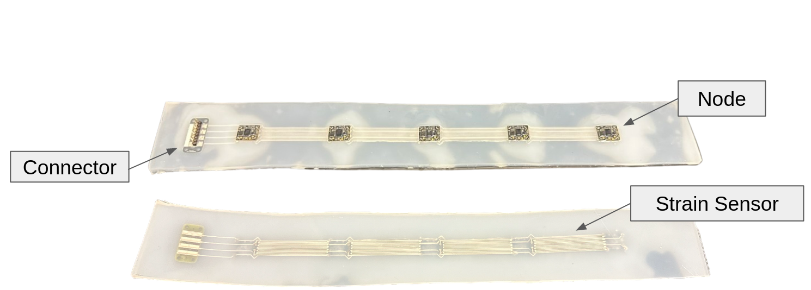

# Stretchable Sensor for Real-Time 3D Reconstruction

A project using ROS2 to process sensor data and test 3D reconstruction algorithms while providing nice visuals

## Description

The goal of this project was to take our custom stretchable sensing hardware and integrate it into a real-time pipeline to provide on-the-fly results during testing. Post-processing large amounts of data after running experiments is clunky and limits troubleshooting capabilities. This project demonstrates one method of using ROS2 and a microcontroller streaming data through pyserial to visualize time-series data and 3D estimates of our sensor's orientation in space. While specific hardware is required (only the sensor data types and organization really need to match) for this project to be implemented without modification, example data from previous experiments are provided as well as a ROS2 node that emulates the datastream of the microntroller so that the visuals can be tested.

### Sensor Hardware
<p align="center">
  
</p>

This sensor is a custom fabrication out of the Oregon State University SIM lab and IMML lab. It's body is made of a soft Ecoflex silicone and all wiring is done using a liquid metal paste. Most importantly for this project is that there are two forms of sensing. There are [9-axis IMUs](https://www.digikey.com/en/products/detail/ceva-technologies-inc/BNO085/9445940) on each sensor node (not to be confused with ROS2 node) embedded in the silicone. These IMUs have built in microcontrollers that perform state estimation and produce quaternion estimates of the IMUs orientation in space. Second, there are liquid metal paste strain sensors that run between the sensor nodes to provide estimates of stretch. 

### 3D Reconstruction

3D state estimates of the sensors are performed using discrete curvature reconstruction. This is functionally accomplished in three main steps. First, a quaternion slerp (using scipy) is run between the quaternion estimates produced by the IMUs on each sensor node. Second, the a set of unit vectors are rotated by the quaternions and scaled by the length of the strain sensors divided by the number of quaternion interpolations. Lastly, the scaled and rotated vectors are added to produce an estimate of the sensor nodes relative poses.

### Visuals

## Getting Started

### Dependencies

- [ROS2 Humble](https://docs.ros.org/en/humble/Installation/Ubuntu-Install-Debians.html)

- [PlotJuggler](https://github.com/facontidavide/PlotJuggler)
  
      sudo apt install ros-$ROS_DISTRO-plotjuggler-ros
  
- [Pyserial](https://pyserial.readthedocs.io)

        pip install pyserial

### Hardware/Firmware (optional)
- A SAMD21 based microcontroller board. This project used an [M0 express](https://www.adafruit.com/product/3403)
- A minimum of two Bosch BNO085 IMUs (easy to use as a [breakout board](https://www.adafruit.com/product/4754))
- For firmware the [Arduino IDE](https://www.arduino.cc/en/software) with the appropriate board definition for programming the SAMD21. Instructions on how to set this up [here](https://learn.adafruit.com/adafruit-feather-m0-basic-proto/using-with-arduino-ide)

### Installing

Make a ROS workspace

    mkdir ros_ws/src && cd src

Clone this repository

    git clone git@github.com:ali-clara/apple_gripper.git

Install all dependencies with [rosdep](https://docs.ros.org/en/humble/Tutorials/Intermediate/Rosdep.html)

    rosdep install --from-paths src -y --ignore-src

Build

    cd ~/ros_ws
    colcon build --symlink-install

### Executing program

To run with hardware
```
ros2 launch stretch_sensor_mocap stretch_sensor_launch.py
```
To run example without hardware using pre-recorded data
```
ros2 launch stretch_sensor_mocap stretch_sensor_csv_launch.py
```
To launch PlotJuggler with a config for viewing the IMU euler angles and strain sensors
```
ros2 launch stretch_sensor_mocap plotjuggler_launch.py
```

## Notes

- While more convenient to launch plotjuggler with the other nodes and rviz, it is launched separately to prevent unknown errors 

## Authors

- Aiden Shaevitz

## License

This project is licensed under the [Mozilla Public License Version 2.0](LICENSE.md)

 
